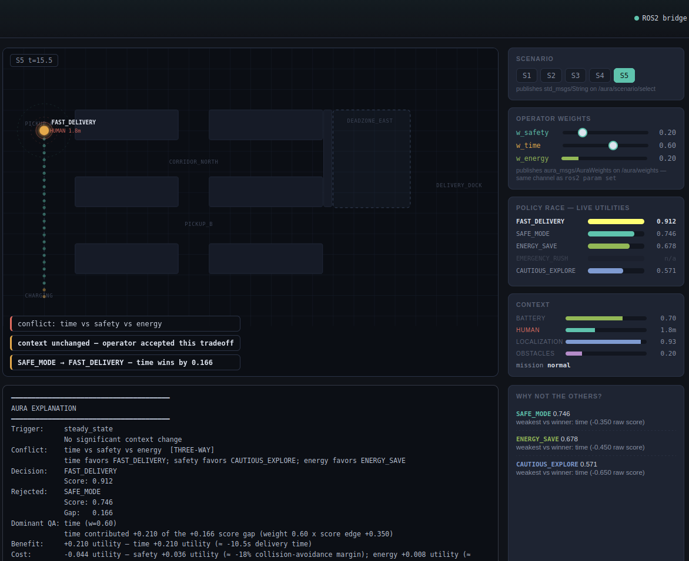
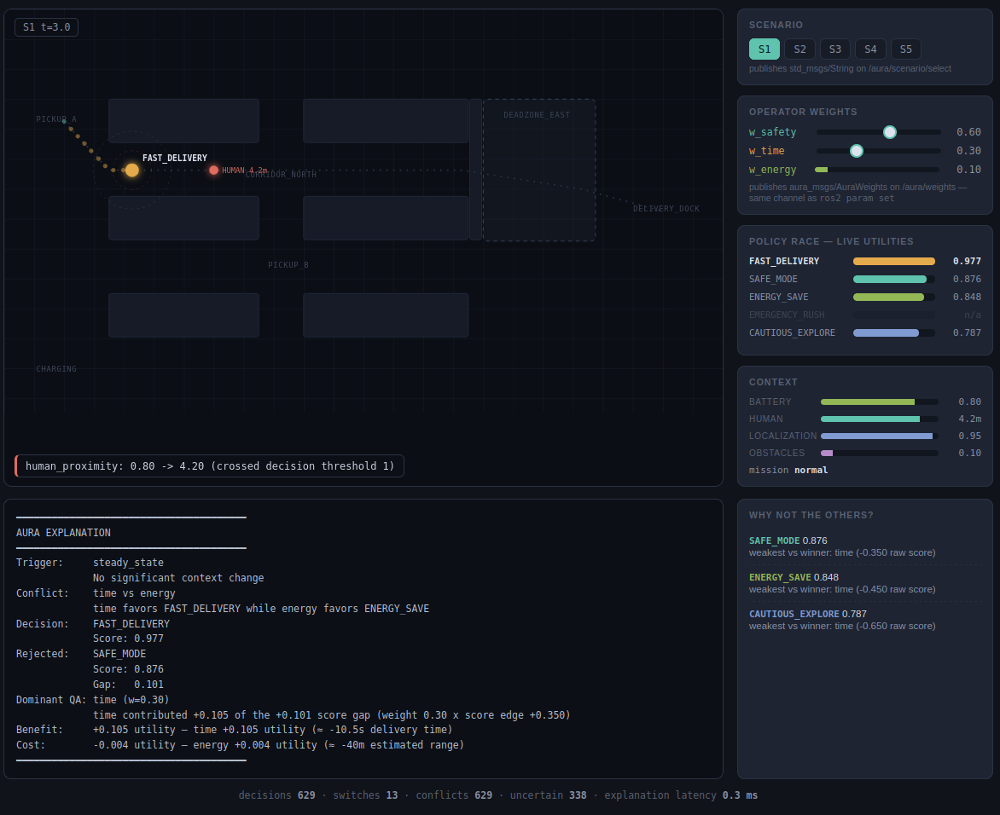
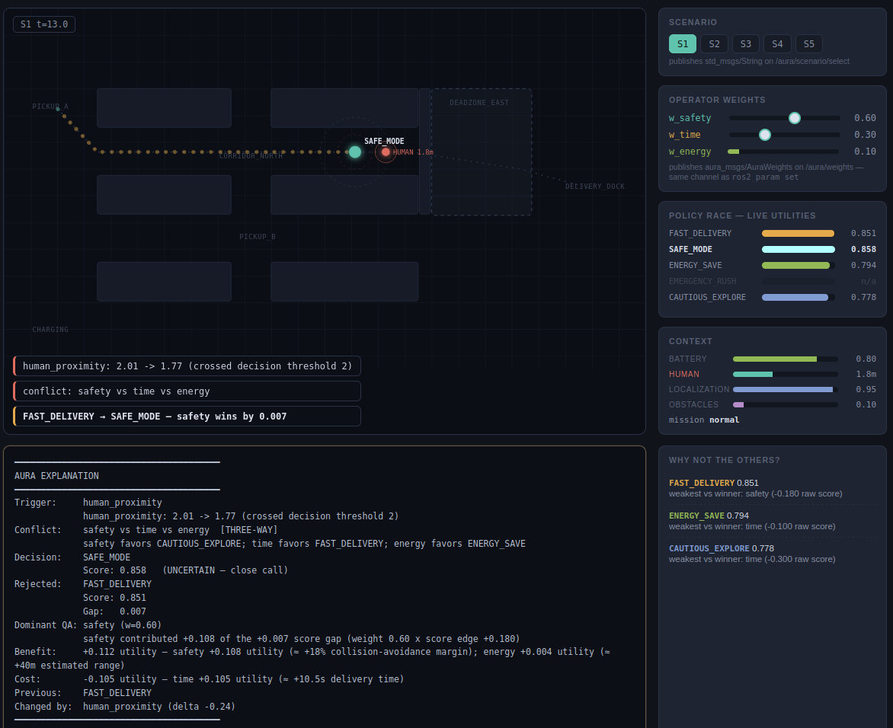
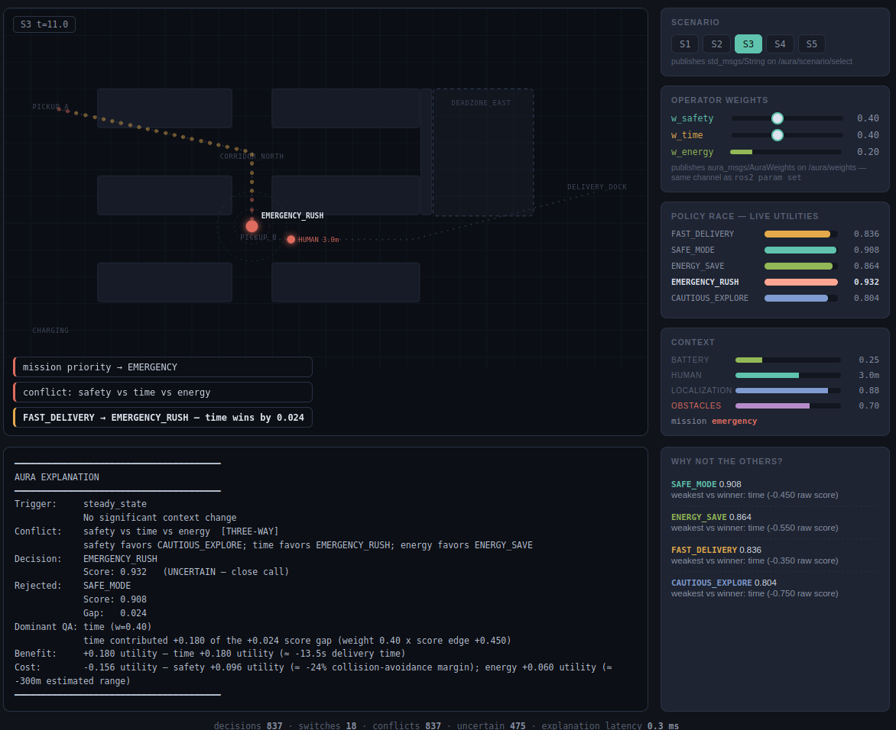
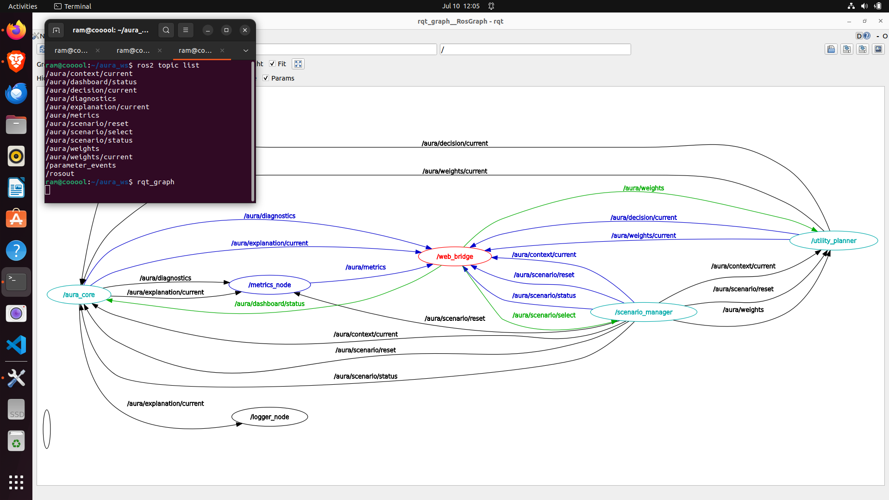
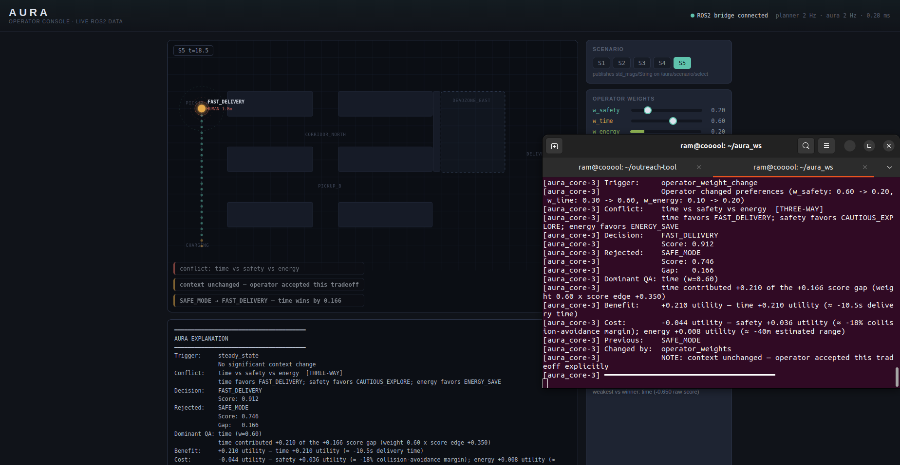

# AURA — Adaptive Utility Reasoning Architecture

Planner-agnostic runtime explainability middleware for adaptive robotic systems.
Built on ROS2 &nbsp;•&nbsp; Modular &nbsp;•&nbsp; Research Prototype

> *"Why did the robot do that?"*
> AURA provides structured, runtime explanations of adaptive robot decisions — without modifying the planner.

AURA is a planner-agnostic explainability middleware for self-adaptive robotic systems built on ROS2. Every time a planner changes the robot's operating policy, AURA decomposes the decision into four structured answers:

1. **Trigger** — which context variable changed, and which decision threshold it crossed
2. **Conflict** — which quality attributes pulled toward different policies simultaneously
3. **Dominant QA** — which attribute's weighted contribution most influenced the outcome
4. **Tradeoff** — what was gained and what was conceded, expressed in utility terms

The explanation engine preserves consistency between the reported utility gap and the quantified tradeoff. Explanations reflect the planner's own published scores — AURA never re-scores or re-ranks.

AURA is a pure **observer**. It never modifies, scores, or overrides policies. Any planner that publishes the `PolicyEvidence` contract is supported without modification — demonstrated by the rule-based planner in `aura_examples/` which AURA explains with zero changes to the engine.

---

## Why AURA?

Adaptive robots continuously change their own behaviour at runtime — slowing near humans, conserving energy when battery is low, switching to emergency mode when a mission priority escalates. Operators typically know *that* something changed, but not *why* the system chose a particular response, which objectives conflicted, or what was traded off.

AURA addresses this by sitting between the planner and the operator. It reads each decision as it is published, decomposes it into a structured explanation, and makes it available in real time — through a terminal, a browser console, and a ROS2 topic — without requiring any changes to the underlying planner or robot.

AURA was inspired by the work of Wohlrab et al. (2023) on explaining quality attribute tradeoffs in self-adaptive systems and explores runtime explainability for adaptive robotic systems implemented on ROS2.

> Wohlrab, R., Cámara, J., Garlan, D., & Schmerl, B. (2023).
> *Explaining quality attribute tradeoffs in automated planning for self-adaptive systems.*
> Journal of Systems and Software.


---

## Screenshots

| Hero — operator weight change | Human intrusion (S1) |
|---|---|
|  |  |

| Threshold crossing | Emergency override — three-way conflict (S3) |
|---|---|
|  |  |

| ROS2 node graph (rqt_graph) | Terminal explanation output |
|---|---|
|  |  |

---

## Demo

A 60-second demonstration video is planned and will be linked here.

[▶ Watch the demo](https://drive.google.com/file/d/1t-igl10lmtP4wRHWzqWPg59DZy4--ksN/view?usp=drive_link)

---

## Architecture

```
scenario_manager ──/aura/context/current──▶ utility_planner
                                                   │
                                      /aura/decision/current
                                                   │
                                                   ▼
                                              aura_core  ◀── explainability engine
                                                   │
                                      /aura/explanation/current
                                          │              │
                                        logger       web_bridge ──WS──▶ browser
```

The explanation engine (`aura_core/engine/`) is pure Python with no ROS2 dependency and is independently unit-tested. The ROS2 node layer is a thin wrapper. The browser renders — it never computes reasoning.

---

## Five candidate policies

| Policy | Speed | Power | Safety tolerance |
|---|---|---|---|
| FAST_DELIVERY | 0.95 | 0.80 | 0.30 |
| SAFE_MODE | 0.60 | 0.40 | 0.90 |
| ENERGY_SAVE | 0.50 | 0.20 | 0.70 |
| EMERGENCY_RUSH | 1.00 | 1.00 | 0.10 |
| CAUTIOUS_EXPLORE | 0.30 | 0.30 | 0.95 |

Policies are loaded from `config/scenarios.yaml` — not hardcoded in the engine.

---

## Requirements

- Ubuntu 22.04
- ROS2 Humble Hawksbill
- Python 3.10
- No third-party Python packages required (WebSocket server uses stdlib only)

---

## Installation

```bash
git clone https://github.com/RamCharan6999/AURA-Adaptive-Utility-Reasoning-Architecture-.git
cd AURA
source /opt/ros/humble/setup.bash
rosdep install --from-paths src --ignore-src -r -y
colcon build
source install/setup.bash
```

---

## Running

```bash
# Full demo — all nodes + operator console
ros2 launch aura_bringup demo.launch.py

# Watch live explanations in a second terminal
ros2 topic echo /aura/explanation/current

# Switch to the rule-based planner
ros2 launch aura_bringup demo.launch.py planner:=rule
```

Open `http://localhost:8080` for the operator console.
Use the **S1–S5** buttons to select evaluation scenarios.
Use the **weight sliders** to trigger operator-driven policy changes (Scenario 5).

---

## Evaluation scenarios

| ID | Name | Trigger | Expected switch |
|---|---|---|---|
| S1 | Human Intrusion | `human_proximity` 4.2m → 0.8m | FAST_DELIVERY → SAFE_MODE |
| S2 | Battery Critical | `battery_level` drains below 0.20 | FAST_DELIVERY → ENERGY_SAVE |
| S3 | Emergency Override | `mission_priority` → emergency | ENERGY_SAVE → EMERGENCY_RUSH |
| S4 | Localization Failure | `localization_confidence` 0.91 → 0.38 | FAST_DELIVERY → CAUTIOUS_EXPLORE |
| S5 | Operator Weight Change | `w_safety` 0.6→0.2, `w_time` 0.3→0.6 | SAFE_MODE → FAST_DELIVERY |

Scenario 5 demonstrates the human-in-the-loop case: the context is unchanged, only the operator's weights change. AURA flags `context_unchanged = true`, making preference-driven switches distinguishable from world-driven ones.

---

## Running the tests

```bash
cd src
PYTHONPATH=aura_core:aura_interfaces python3 -m unittest discover -s aura_core/test
```

14 unit tests covering the explanation engine, gap decomposition, and analyzer logic.

---

## Adding a new planner

```python
from aura_interfaces.base_planner import AuraBasePlanner

class MyPlanner(AuraBasePlanner):
    def score_candidates(self, context, weights):
        # your logic — return List[PolicyEvidence]
        ...
```

Subclass `AuraBasePlanner`, implement `score_candidates()`. AURA explains it without modification. See `aura_examples/rule_planner_node.py` for a complete 60-line example.

---

## Repository structure

```
src/
├── aura_msgs/          ROS2 message definitions
├── aura_interfaces/    Pure-Python shared types + planner base class
├── aura_core/          Explainability engine + ROS2 nodes + scenarios
├── aura_dashboard/     WebSocket bridge + operator console
├── aura_bringup/       Launch files and configuration
└── aura_examples/      Rule-based planner (planner-agnosticism demo)
```

---

## Future work

- Multi-planner evaluation: rule-based, RL (stable-baselines3), and LLM-based planners
- Real hardware deployment on Duckiebots (replace `scenario_manager` with a sensor interface)
- Offline / online explanation comparison
- Publication in a software engineering for adaptive systems venue

---

## Citation

```bibtex
@software{aura2026,
  title  = {AURA: Adaptive Utility Reasoning Architecture},
  author = {Akula, Ram Charan},
  year   = {2026},
  url    = {https://github.com/RamCharan6999/AURA-Adaptive-Utility-Reasoning-Architecture-}
}
```

---

## Acknowledgements

Inspired by the quality attribute tradeoff explanation work of Wohlrab, Cámara, Garlan, and Schmerl (2023).
